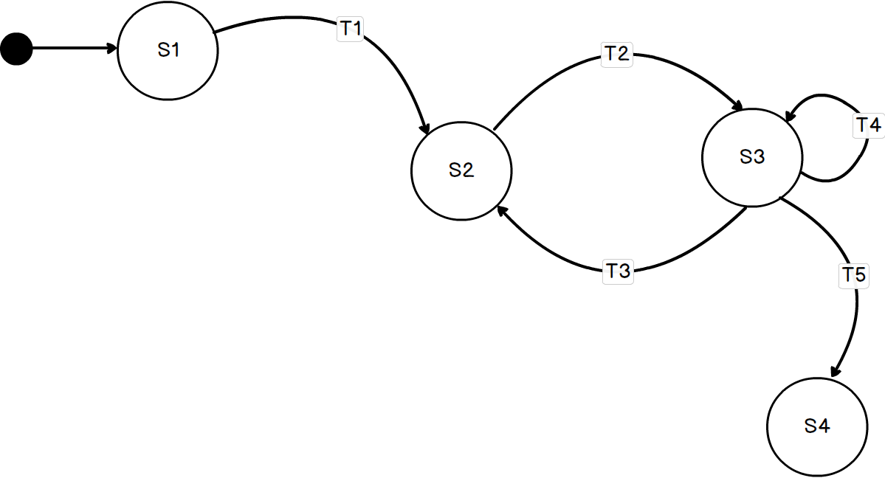

# Maszyna stanów w praktyce
Kod źródłowy pochodzący z mojego webinarium.

## Wprowadzenie
**Maszyna stanów** może wydawać abstrakcyjną, matematyczną koncepcją, o której zwykle zapominamy wraz z zaliczonym egzaminem na studiach. 
Jednak w rękach sprytnego programisty może być bardzo efektywnym wzorcem do zarządzania stanem obiektu, np. zamówienie, faktura, wniosek urlopowy, sterowanie sprzętem.

## Wymagania
- .NET Core 3.1 lub wyższy

## Abstrakt
Maszyna stanów to zbiór stanów _states_ (s1, s2 ... sN) oraz przejść _triggers_ (t1, t2 ... tN). 
Obiekt może znajdować się w jednym momencie tylko w jednym ze stanów.
Na początku maszyna stanów przyjmuje stan początkowy. Przejścia pomiędzy stanami następują za pomocą triggerów.

## Instalacja biblioteki

~~~ bash
dotnet add package Stateless
~~~

## Definicja maszyny stanów
Za pomocą konstruktora określamy typ stanu (State), typ wyzwalacza (Trigger) oraz stan początkowy (Init State).
~~~ csharp
 StateMachine<TrafficLightState, TrafficLightTrigger> machine = new StateMachine<TrafficLightState, TrafficLightTrigger>(TrafficLightState.Green);
~~~

## Konfiguracja przejść 

Za pomocą metody _Configure_ konfigurujemy określony stan, a za pomocą metody _Permit_ definiujemy dopuszczalne przejście pomiędzy stanami.
~~~ csharp
 machine.Configure(TrafficLightState.Green)                
                .Permit(TrafficLightTrigger.Push, TrafficLightState.Yellow)
                .Permit(TrafficLightTrigger.Break, TrafficLightState.Blinking);

            machine.Configure(TrafficLightState.Yellow)                
                .Permit(TrafficLightTrigger.Push, TrafficLightState.Red);

            machine.Configure(TrafficLightState.Red)                
                .Permit(TrafficLightTrigger.Push, TrafficLightState.Green)
                .Permit(TrafficLightTrigger.Break, TrafficLightState.Blinking);

            machine.Configure(TrafficLightState.Blinking)
                .Permit(TrafficLightTrigger.Push, TrafficLightState.Red);
~~~

## Uruchomienie wyzwalacza
Na podstawie wcześniej zdefiniowanej konfiguracji nastąpi przejście do kolejnego stanu.
Jeśli przejście nie zostało zdefiniowane wygenerowany zostanie wyjątek.

~~~ csharp
machine.Fire(TrafficLightTrigger.Push);
~~~

## Sprawdzenie możliwości uruchomienia wyzwalacza
Jeśli chcemy uniknąć wyjątku możemy odpytać maszynę czy możliwe jest przejście z bieżącego stanu do określonego stanu.

~~~ csharp
machine.CanFire(TrafficLightTrigger.Push)
~~~

## Pobranie bieżącego stanu
Za pomocą właściwości _State_ możemy odczytać bieżący stan maszyny.
~~~ csharp
Console.WriteLine(machine.State)
~~~ 

## Śledzenie maszyny stanów   
Możemy również logować przejścia pomiędzy stanami.

~~~ csharp
 machine.OnTransitioned(t=> logger.LogInfo($"{t.Source} -> {t.Destination}"));
~~~    

## Wygenerowanie grafu
~~~ csharp
Console.WriteLine(Stateless.Graph.UmlDotGraph.Format(machine.GetInfo()));
~~~
Zostanie wygenerowany graf w formacie [ DOT Graph](https://en.wikipedia.org/wiki/DOT_(graph_description_language)), który można następnie zwizualizować!

## Wizualizacja grafu
- http://www.webgraphviz.com
- https://dreampuf.github.io/GraphvizOnlin

## Biblioteki w innych językach
- **Arduino** Automaton
https://www.arduinolibraries.info/libraries/automaton

- **Go** Stateless https://github.com/qmuntal/stateless

